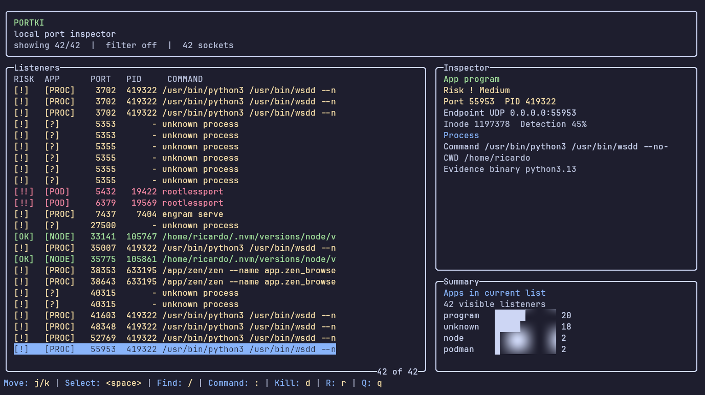

<pre>
██████╗  ██████╗ ██████╗ ████████╗██╗  ██╗██╗
██╔══██╗██╔═══██╗██╔══██╗╚══██╔══╝██║ ██╔╝██║
██████╔╝██║   ██║██████╔╝   ██║   █████╔╝ ██║
██╔═══╝ ██║   ██║██╔══██╗   ██║   ██╔═██╗ ██║
██║     ╚██████╔╝██║  ██║   ██║   ██║  ██╗██║
╚═╝      ╚═════╝ ╚═╝  ╚═╝   ╚═╝   ╚═╝  ╚═╝╚═╝
</pre>

`portki` is a Node-powered Linux TUI for inspecting local port listeners and stopping them with a conservative kill policy.

It is built for developer machines where ports are constantly occupied by Next.js, NestJS, Vite, Docker, Podman, MCP servers, databases, and background tools. The scanner reads Linux `/proc` directly, so normal usage does not depend on `lsof`, `ss`, or `fuser`.

## Preview



## Features

- Dense lazygit-style TUI with listener list, inspector, summary chart, search, command mode, and centered confirmations.
- Fast Linux scanner based on `/proc/net/*` plus `/proc/<pid>/fd` inode mapping.
- App detection for Next.js, NestJS, Vite, Node, Bun, Deno, Docker, Podman, MCP servers, Postgres, Redis, MySQL, and generic programs.
- Safe kill flow: `SIGTERM` first, short wait, second confirmation before `SIGKILL`.
- Group selection with `<space>` and grouped kill confirmation.
- Parseable CLI output for scripting with `portki list --json`.

## Install

```sh
curl -fsSL https://raw.githubusercontent.com/ricardojparram/portki/main/install.sh | sh
```

Manual npm install:

```sh
npm install -g portki
```

Requirements:

- Linux with `/proc` mounted.
- Node.js `>=20.0.0`.
- npm.
- A terminal with truecolor support recommended.

## Usage

Open the TUI:

```sh
portki
```

List listeners as JSON:

```sh
portki list --json
```

Kill by port or PID using the same safe policy as the TUI:

```sh
portki kill 3000 --safe
portki kill 675399 --safe
portki kill 3000 --safe --force
```

## Controls

```text
Move: j/k | Select: <space> | Find: / | Command: : | Kill: d | Refresh: r | Quit: q
```

Command mode supports:

```text
:kill 3000
:kill-pid 1234
:filter next
:refresh
:quit
```

Kill confirmations accept `y` or `Enter`. `Esc` cancels modals and line input.

## Safety Model

- Blocks unresolved PIDs, PID 1, and the running `portki` process.
- Marks infrastructure listeners such as Postgres, Redis, MySQL, Docker, and Podman as high risk.
- Never sends `SIGKILL` first.
- Requires a second confirmation before force killing remaining processes.
- Shows partial data when `/proc` permissions prevent reading process details.
- Never asks for sudo.

## Development

Runtime is Node-first. Development still uses Bun for tests and bundling.

```sh
git clone https://github.com/ricardojparram/portki.git
cd portki
bun install
bun test
bun run check
bun run build
```

Run locally:

```sh
bun run build
./bin/portki
```

Install locally as a global command:

```sh
npm install -g .
portki
```

Release check:

```sh
bun run release:check
```

That command runs typecheck, tests, build, and `npm pack --dry-run`.

## Contributing

Contributions are welcome.

Good first areas:

- App detection patterns for more frameworks, tools, and container helpers.
- Linux distro edge cases in `/proc` parsing.
- TUI layout improvements for small terminals.
- Tests for scanner fixtures, kill policy, and keyboard flows.
- Documentation and screenshots.

Before opening a PR:

```sh
bun install
bun run release:check
```

Please keep the kill policy conservative. Changes that send signals, infer risk, or expand process detection should include focused tests.

## Publishing

Publishing is manual for now:

```sh
bun run release:check
npm publish
```

The npm tarball is intentionally small and includes only:

- `assets/`
- `bin/`
- `dist/`
- `README.md`
- `LICENSE`
- `package.json`

## License

MIT
